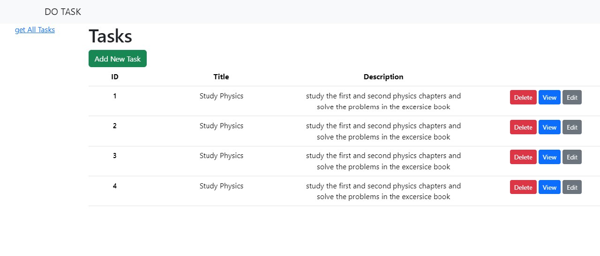
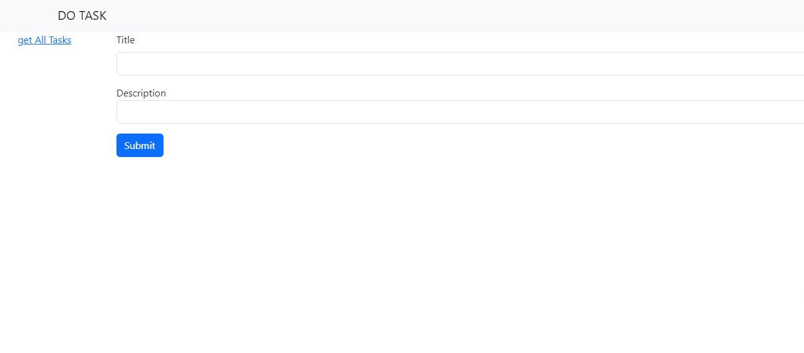
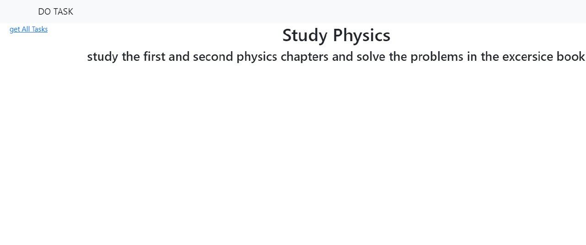

# DoTask

## 📝 Table of Contents

- [About](#about)

- [Technologies used](#build)
- [getting started](#start)
- [screenshots](#screenshots)

### 🚩About<a name = "about"></a>

DoTask is a website for managing your daily tasks, you can add, delete, edit and view your tasks. 


## 💻Technologies Used<a name = "build"></a>

- React
- React-Router dom

## 🏁Getting Started <a name = "start"></a>

1. **_Clone the repository_**

```bash
git clone [https://github.com/Omaar2000/BASIC-CRUD-APP]

```

2.   **_Watch the db.json file to retrieve and save tasks_**

```bash

json-server --watch db.json --port 9000

```
3. **_Go to the directory of the repository_**

```bash
cd crud

```

4. **_Run_**

```bash
npm install
npm start
```

**_runs at port 3000_**

## 🎥 screenshots<a name = "screenshots"></a>

- Home Page
  
  

  <hr />

- Add & Edit Page
  

  <hr />

- View page
  

  <hr />
